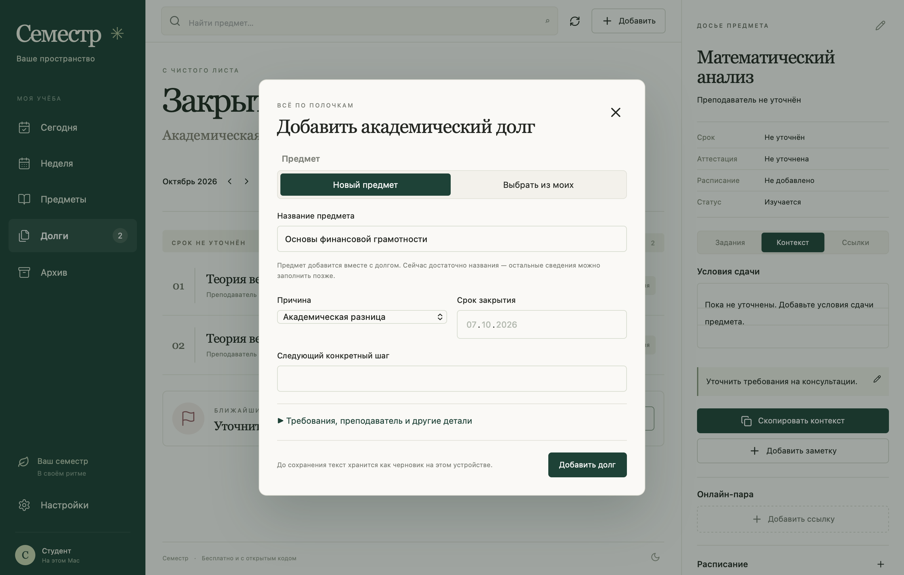

# Семестр

Бесплатное приложение для учёбы на Mac: предметы, расписание, задания, академические долги, заметки и материалы. MIT, без подписки и AI API.

## Скачать и открыть

**[Скачать Семестр для Mac (.dmg)](https://github.com/Melnk/semestr/releases/latest/download/Semestr-macOS-universal.dmg)** · [ZIP](https://github.com/Melnk/semestr/releases/latest/download/Semestr-macOS-universal.zip) · [Все релизы](https://github.com/Melnk/semestr/releases)

**macOS 13+ · Apple Silicon и Intel · бесплатно · MIT**

1. Скачайте `.dmg` по ссылке выше и откройте его.
2. Перетащите **«Семестр.app»** в **«Программы»** и запустите. Можно использовать свою папку `~/Applications`.
3. Укажите семестр и часовой пояс в настройках. Начните с предмета или сразу добавьте академический долг по его названию.

**При первом запуске:** релиз пока без подписи Developer ID и нотариализации Apple. Если macOS не разрешает открытие из-за непроверенного разработчика, после попытки запуска подтвердите открытие «Семестра» в **«Системные настройки → Конфиденциальность и безопасность»**, если доверяете этому релизу. [Официальная инструкция Apple](https://support.apple.com/ru-ru/102445). На рабочем Mac доступность подтверждения определяется политиками ИТ-отдела.

Приложению не нужны Docker, сервер, Node.js, регистрация или интернет. Интернет нужен только при переходе по вашим ссылкам на онлайн-пары и материалы. Версий для Windows и Linux пока нет.



## Возможности

- «Сегодня», «Неделя», «Предметы», «Долги», «Архив», «Настройки».
- Предметы с экзаменами в начале списка, преподавателями, условиями сдачи, контактами, ссылками и отдельным статусом.
- Задания с дедлайнами и состояниями от «Нужно сделать» до «Принято».
- Долги с причиной, сроком, следующим шагом и подтверждением закрытия.
- Повторяющиеся занятия, чётность недель, часовые пояса, переход через полночь, пересечения, разовые переносы и отмены.
- Досье предмета, заметки, поиск, копирование контекста в буфер обмена.
- Системные уведомления macOS: выбор типов занятий, напоминания о дедлайнах и выключатель звука.
- Светлая и тёмная темы, меню macOS и системные окна импорта/экспорта.
- JSON-экспорт (`⌘E`), проверка импорта, добавление либо подтверждённая замена данных одной транзакцией.

## Добавить долг по новому предмету

В приложении Mac откройте **«Добавить → Академический долг»** и введите **название предмета**. Нажмите **«Добавить долг»**: предмет создастся автоматически вместе с долгом. Причина по умолчанию — «Академическая разница». Срок, требования и преподавателя можно указать позже.

Если предмет уже добавлен, нажмите **«Выбрать из моих»**. При вводе совпадающего названия форма также предложит использовать существующий предмет. Название и выбранный режим сохраняются в черновике. При ошибке ни долг, ни новый предмет не создаются.

## Настроить уведомления

Откройте **«Настройки → Уведомления»**, включите общий переключатель и сохраните. Можно оставить только **практики за 5 минут**, а дедлайны — **за час и сутки**. Занятия, дедлайны и звук отключаются отдельно. При первом включении macOS запросит разрешение.

Напоминания планируются заранее и работают при закрытом приложении. Дата, до которой подготовлена очередь, показана в настройках: открывайте приложение до неё для продления. [Подробности и ограничения](docs/notifications.md).

## Перенести настройки на другой Mac или в другую учётную запись

1. Сначала сохраните профиль в «Настройках».
2. В разделе **«Перенос настроек»** нажмите **«Сохранить настройки в файл»**.
3. Передайте JSON-файл на другой Mac (например, через AirDrop или флешку).
4. В «Семестре» версии 0.4 или новее под нужной учётной записью откройте тот же раздел, нажмите **«Загрузить настройки из файла»**, проверьте значения и выберите **«Применить настройки»**.

Переносятся имя, университет, направление, группа, семестр, часовой пояс, начало учебной недели, светлая/тёмная тема и параметры уведомлений. Разрешение macOS выдаётся отдельно на каждом Mac. Предметы, задания, долги, заметки и расписание получателя остаются прежними. Файл не привязан к идентификатору аккаунта. Применение требует отдельного нажатия; отмена ничего не меняет. Если настройки изменились после предпросмотра, загрузите файл повторно.

Для переноса учебных записей используйте расположенный ниже раздел «Ваши данные — с вами».

## Где хранятся данные

`~/Library/Application Support/Semestr/semestr.sqlite3` — база SQLite на вашем Mac. Она сохраняется отдельно от приложения, поэтому замена `.app` не удаляет записи. Открыть папку можно в «Настройках».

Для резервных копий и переноса используйте **«Настройки → Экспортировать»**. Персональные данные не отправляются на сервер. Автоматической синхронизации между компьютерами нет. База не шифруется самим приложением; доступ определяется защитой вашей учётной записи macOS.

## Собрать из исходников

Нужны macOS 13+, Xcode Command Line Tools, Node.js 22.13+ и pnpm 11.25.0. Rust, Docker и Java для приложения Mac не нужны.

```sh
git clone https://github.com/Melnk/semestr.git
cd semestr
pnpm install --frozen-lockfile
pnpm desktop:build
open dist/Семестр.app
```

Скрипт собирает React-интерфейс и Swift-приложение под архитектуру текущего Mac, запускает проверки локальной базы, создаёт иконку и ставит локальную ad-hoc подпись. Для универсального `.dmg` и ZIP выполните `pnpm desktop:release`: файлы появятся в `dist/release`, включая SHA-256. [Процесс выпуска](docs/releasing.md).

```sh
pnpm test
pnpm desktop:test
SEMESTR_TEST_OUTPUT="$PWD/artifacts" dist/Семестр.app/Contents/MacOS/Semestr --ui-test
```

UI-проверка использует отдельную временную базу, не пользовательские данные.

## Устройство проекта

- `scripts/package-macos.sh` — универсальные DMG/ZIP для скачивания.
- `apps/macos` — окно AppKit, системный WebKit, мост команд и SQLite. Нет HTTP-сервера или открываемого порта.
- `apps/web` — React + TypeScript, общий интерфейс.
- `packages/api-client` — типы, выбор локального моста или HTTP для отдельной веб-версии.
- `backend`, `infra` — прежняя серверная версия Kotlin/PostgreSQL. Для `.app` не используется.
- `apps/desktop` — исходники прежней экспериментальной Tauri-оболочки. Не входят в текущую сборку.

Документация: [приложение Mac](docs/macos.md), [проверки](docs/verification.md), [веб-разработка](docs/development.md), [серверная архитектура](docs/architecture.md), [API](docs/api.md), [размещение сервера](docs/self-hosting.md), [участие](CONTRIBUTING.md), [безопасность](SECURITY.md).

Мобильного приложения и вложенных файлов пока нет. Сообщить об ошибке или предложить улучшение можно в [Issues](https://github.com/Melnk/semestr/issues). В демонстрации и на скриншоте используются вымышленные учебные записи.

[MIT License](LICENSE) · Made by [Melnk](https://github.com/Melnk).
